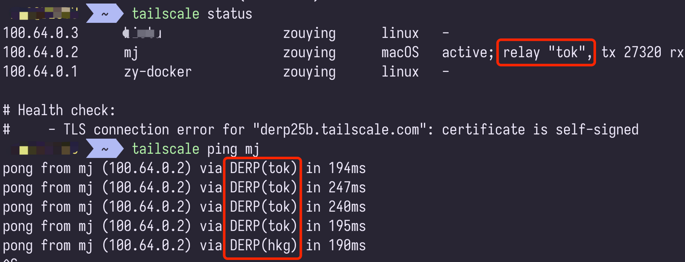
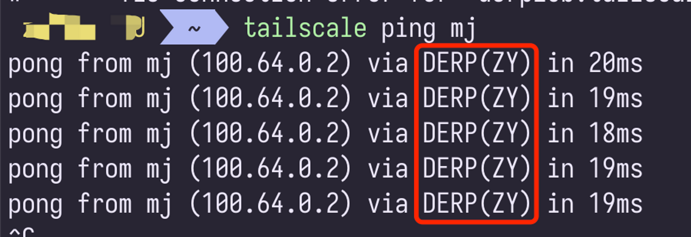

# headscale

自建 headscale 服务，自建 derper 节点

## 1、教程

完整的教程参考我的博客：

- [自建 HeadScale 管理你的虚拟机集群](https://haha.ai/article/headscale)

- [自建 DERP Server](https://haha.ai/article/derper)

通过上面的教程手把手教会你，

1. 搭建自己的 Headscale：通过 Headscale 管理自己的节点。
2. 部署 Caddy 服务：通过 Caddy 完成反向代理。
3. 搭建自己的 DERP 服务：通过自己搭建的 DERP 节点加速节点之间的访问。

## 2、效果对比

使用 Tailscale 官方的 DERP 效果，

使用自建的 DERP 节点效果，

